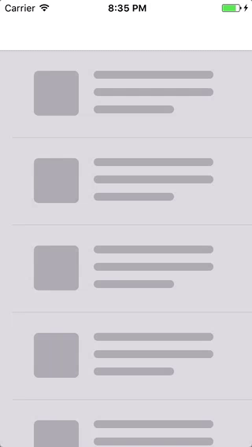

# RainyRefreshControl

Simple refreh control for iOS based on [POP](https://github.com/facebook/pop), SpriteKit and Core Graphics.

Project inspired by [concept](https://dribbble.com/shots/2242263--1-Pull-to-refresh-Freebie-Weather-Concept) of [Yup Nguyen](https://dribbble.com/yupnguyen)

## License

RainyRefreshControl is released under the MIT license. See [LICENSE](LICENSE) for details.